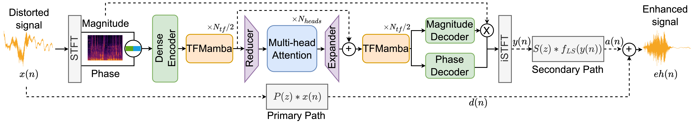

# ASE-TM (Active Speech Enhancement Transformer-Mamba model)

This repository contains the implementation of the ASE-TM model.

In this work, we introduce a new paradigm for active sound modification: Active Speech Enhancement (ASE). Active Noise Cancellation (ANC) algorithms focus on suppressing external interference, while ASE goes further by actively shaping the speech signal—both attenuating unwanted noise components and amplifying speech-relevant frequencies—to improve intelligibility and perceptual quality. To enable this, we propose a novel Transformer-Mamba-based architecture, along with a task-specific loss function designed to jointly optimize interference suppression and signal enrichment. Our method supports multiple speech processing tasks—including denoising, dereverberation, and declipping.

---

## Requirements

We used the following package versions (other versions may work as well):

- Python == 3.10  
- CUDA >= 12.0  
- PyTorch == 2.5.1
- TensorBoard==2.18.0
- mamba-ssm==2.2.4
- rir-generator==0.2.0
- pyroomacoustics==0.8.3
- pesq==0.0.4


## Model Architecture



## Additional Notes

1. Ensure that both `nvidia-smi` and `nvcc -V` show CUDA version 12.0 or higher to confirm compatibility.

2. Currently, only RTX series GPUs and newer are supported. Older GPUs (e.g., GTX 1080 Ti, Tesla V100) may not be compatible due to hardware limitations.  
   We used an NVIDIA RTX A6000 with 48 GB of memory.

3. The codebase includes several model architectures that we tested during development. Our final ASE-TM architecture is implemented as `SEMambaCoDe2dReAt`, and its corresponding configuration file is the one with the suffix `_v44`.

## Installation

### (Recommended) Step 0 – Create a Python environment with Conda

To avoid conflicts, it's highly recommended to use a separate environment:

```bash
conda create --name mamba python=3.10
conda activate mamba
```

### Step 1 – Install PyTorch

Install PyTorch 2.5.1. It's best to follow the instructions on the [official PyTorch website](https://pytorch.org/get-started/previous-versions/) based on your system (OS, CUDA version, etc.).

### Step 2 – Install Required Packages

Once the environment is set up and PyTorch is installed, install the required dependencies:

```bash
pip install -r requirements.txt
```

## Training the Model

### Step 1 – Prepare the Dataset

Follow the instructions in `data/README.md` to prepare the datasets and generate RIR files for training.

### Step 2 – Configure the Model

Choose or customize a model configuration file depending on your task. See details in `recipes/README.md`.

### Step 3 – Run the Training Script

Refer to `train_and_infrence_scripts/README.md` for instructions. The training scripts support command-line arguments.

**Tip:** Use TensorBoard to monitor training progress:
```bash
tensorboard --logdir exp/path_to_your_exp/logs
```

## Inference

Follow the instructions in `train_and_infrence_scripts/README.md` and use the appropriate inference script.  
Ensure that your configuration file includes the path to the test dataset JSON.  
The inference scripts also support command-line arguments.

## Evaluation

Evaluation metrics are computed using the script:
```bash
utils/compute_metrics.py
```

## References and Acknowledgements

We thank the authors of [DeepASC](https://github.com/mishalydev/DeepASC) for their contributions to acoustic path simulation and for re-implementing baseline models.
